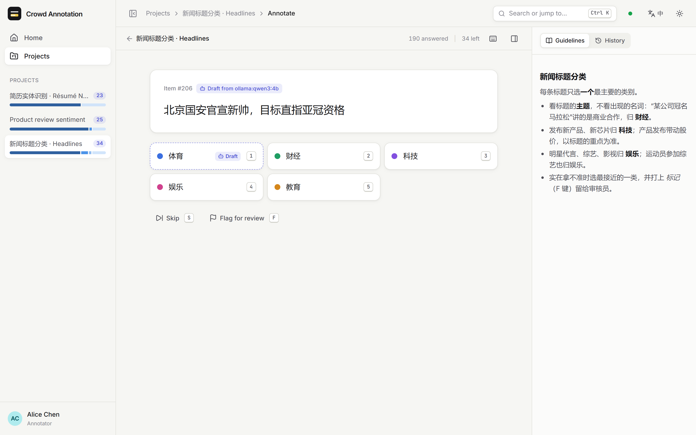
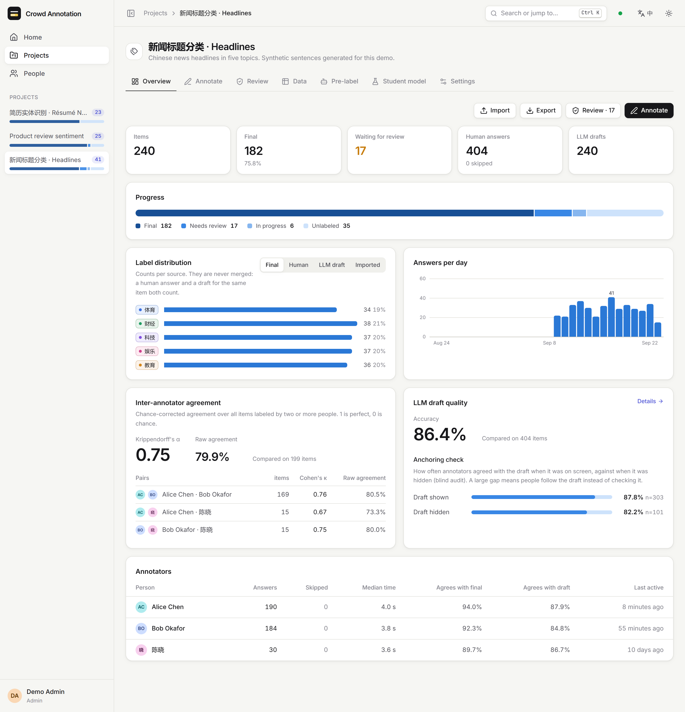
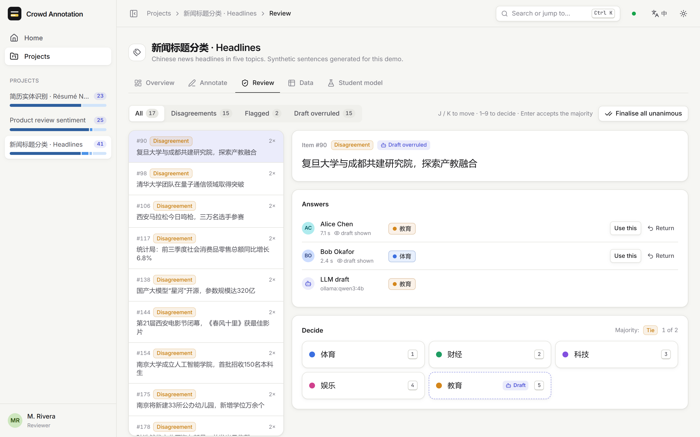
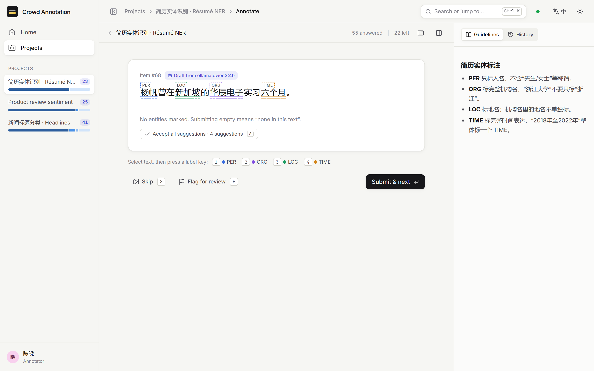
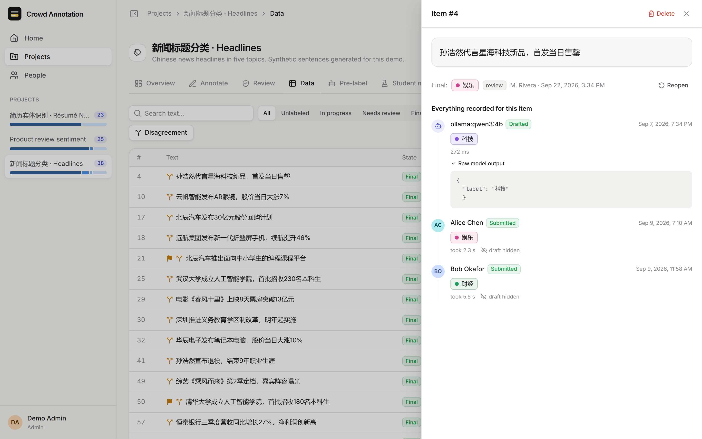
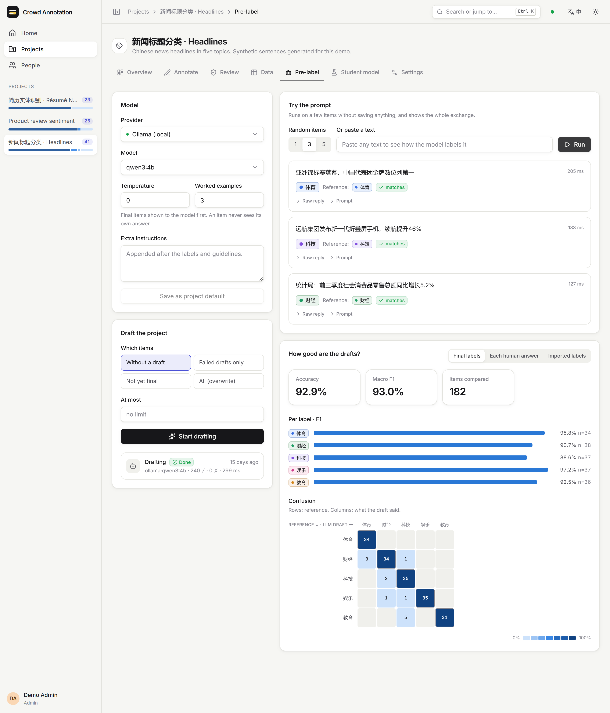
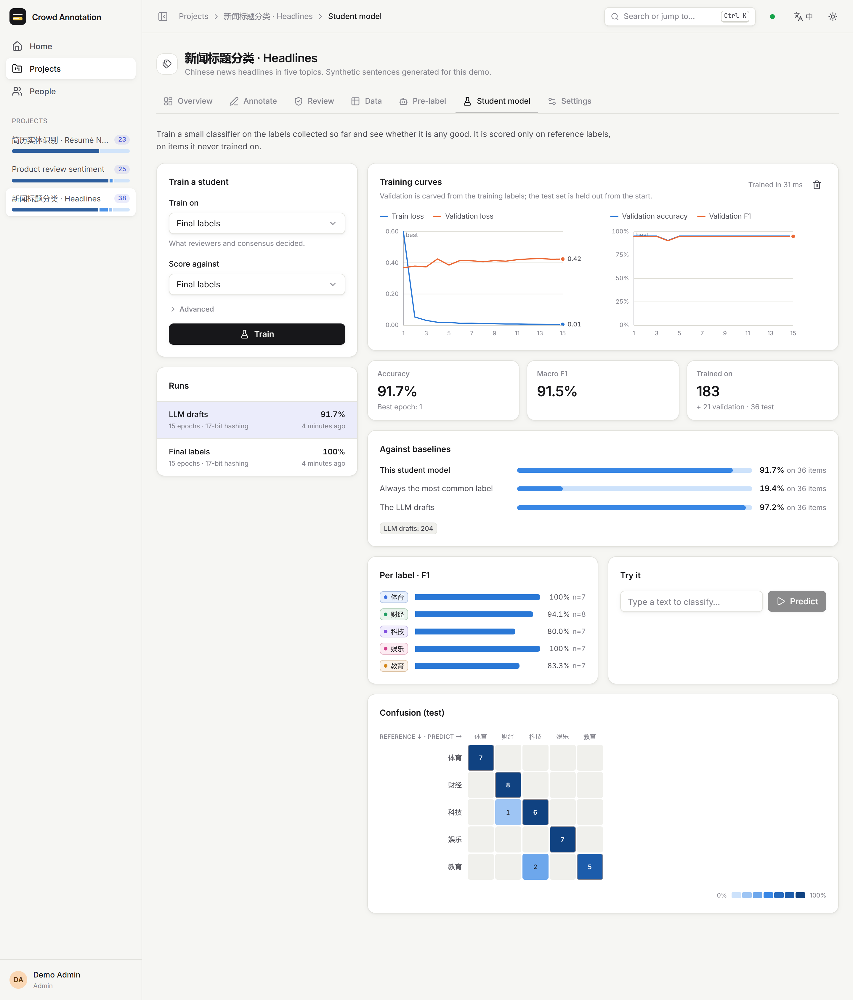
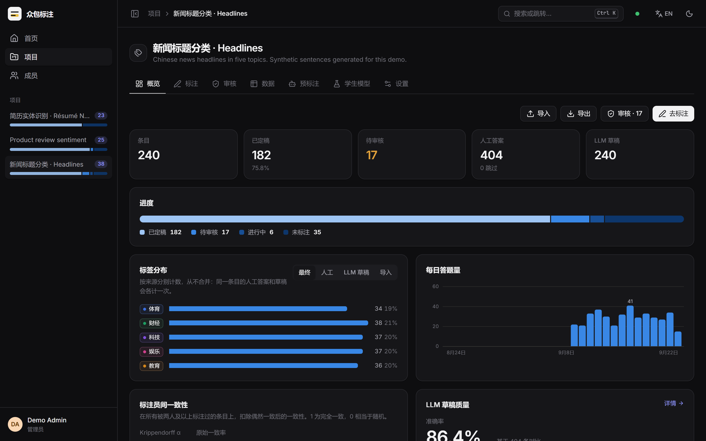
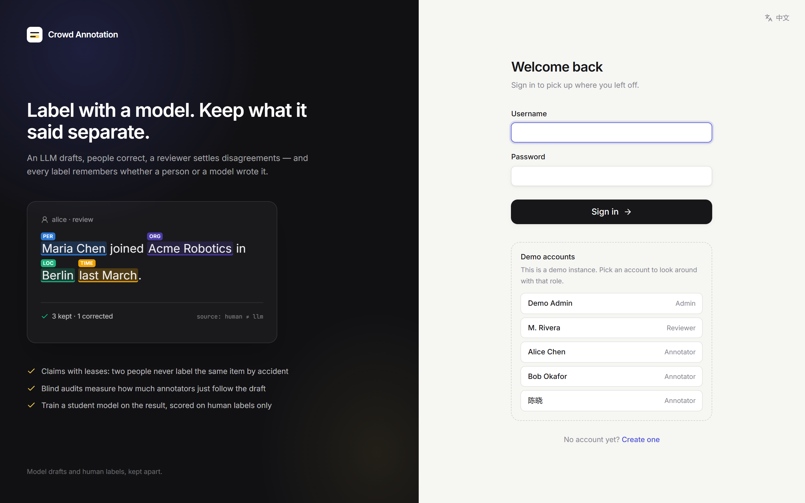

# crowd-annotation-platform

A labelling tool for the workflow where a language model drafts labels and people check
them. Annotators are served one item at a time, a reviewer settles disagreements, and the
result trains a small model that can be compared against the drafts it learned from.

The forms are the easy part. The hard part is keeping the record honest: knowing for every
label whether a person or a model produced it, whether the person checked the draft or just
accepted it, and whether an accuracy figure was measured against labels the model itself
wrote. None of that fails loudly when it goes wrong. You get a plausible label and no error.



## Why a rewrite

This is v2. [v1](https://github.com/liu-x27/crowd-annotation-platform/tree/v1) ran for one
real labelling job and looked fine doing it. Migrating its database into v2 — which forced
every record to pass v2's checks — showed where it had been quietly recording the wrong
thing:

- **Failures became labels.** When the model's reply didn't contain a label, or the request
  failed, the pre-labeller saved the task's *first* label as the model's answer. It also
  matched labels as substrings anywhere in the reply, so a reply that mentioned two labels
  counted as whichever came first in the list.
- **A confidence nobody measured.** Drafts written by the platform carried a confidence of
  0.9 whatever the model said — 2,274 of them.
- **Duplicate drafts.** Nothing stopped an item being drafted twice: there were 479 surplus
  drafts, and on 99 items they disagreed with each other, so "the model's label" depended
  on which row a query happened to return.
- **Offsets that counted the badges.** The NER page measured selection offsets from a DOM
  range that included the label badges drawn inside highlighted spans. 3 of 1,559 stored
  spans pointed at the wrong characters.
- **Saving the assignment dialog moved people's work.** It displayed each existing
  assignment as items 1…N, whatever range had actually been assigned, and saving wrote
  that back — after clearing the annotator's assignments and without checking anyone
  else's. Changing one task could move an annotator from items 201–400 to 1–200 and take
  those items from whoever held them.
- **Exports weren't filtered.** v1's README said a task could be exported human-only,
  model-only or both. The endpoint wrote every annotation of every source and review status
  into one file, one row per annotation, and left the filtering to whoever opened it.
- **No claims.** Where items were not assigned, everyone drew from one pool and two people
  could be served the same item. (v1's README said so.)

**A correction to v1's README.** It said 3,063 samples "went through the review queue a
sample at a time". The data doesn't support that. v1 stored every non-draft label as a
human annotation, including gold labels written by import scripts. Counting only those
created at a human pace — fewer than 100 in the same minute for the same task — leaves
**91 annotations**. The other 94,121 arrived in bulk and are migrated as imported labels,
not human ones. [docs/MIGRATING_FROM_V1.md](docs/MIGRATING_FROM_V1.md) has the rule and the
full reconciliation.

What v2 does about each:

| v1 | v2 |
|---|---|
| failure → first label | A failed or unparseable call is an `error` row that keeps the raw reply. The parser accepts exactly one allowed label, or entities it can place on the text. |
| made-up confidence | Drafts store no confidence: none of the providers reports one, and v2 doesn't invent it. Migrated values survive only where v1 recorded a real one. |
| duplicate drafts | A partial unique index allows one draft per item, one imported label per item, one answer per person per item. |
| offsets from the DOM | Offsets come from data attributes on each character, are counted in code points, and are re-checked by the server, which derives the span text itself. |
| assignment dialog | Ranges are stored and shown as ranges. They limit who is served what; exclusivity comes from claims. |
| unfiltered export | Every export names its label source: final, human, llm, import, or all. |
| no claims | Items are claimed under a lease with `FOR UPDATE SKIP LOCKED`. |

## What it does

The loop: **import items → an LLM drafts labels → annotators label with the draft as a
suggestion → answers that disagree go to review → final labels train a student model and
export.** Human answers, model drafts and imported labels are separate sources throughout;
nothing merges them silently.

- **Annotation.** Classification and span-level NER, both keyboard-first — number keys for
  labels, `S` to skip, `F` to flag for review, `?` for the rest. Each claim carries a lease;
  redundancy N gives every item to N different people; answers can be changed until the
  item is final.
- **Blind audit.** A fixed share of claims hides the draft, decided by a hash so it is
  stable. Agreement with the draft is then reported separately for shown and hidden
  claims. If annotators agree with the model far more often when they can see it, the
  review loop is measuring deference, not correctness.
- **Review.** A queue ordered disagreement-first; a reviewer finalises with any label,
  accepts the majority, finalises all unanimous items at once, or returns one answer to its
  author with a note (it comes back to them first).
- **Agreement.** Krippendorff's α and pairwise Cohen's κ for classification, pairwise span
  F1 for NER, per-annotator agreement with the final labels and with the drafts.
- **LLM drafting.** Ollama (grammar-constrained JSON), Claude (official SDK, structured
  output) or any OpenAI-compatible server. A prompt preview shows the full exchange on a
  few items without saving anything; worked examples never include the item being
  labelled; errors that would repeat (bad key, unknown model) stop the job at the first one.
- **Student models.** Trained in a worker thread: TF-IDF + logistic regression for
  classification, an averaged perceptron with constrained Viterbi for NER. The test set is
  drawn first and only then are training labels chosen, from final labels, human
  majority, the LLM drafts alone, or a mix — so a draft can never train a model that is then
  scored on the same item's human label. Every report shows a trivial baseline and the
  drafts' own score on the same test items.
- **Data.** Import CSV, TSV, JSON or JSONL with de-duplication and optional labels; filter
  by state, text, label or draft status; see everything recorded for an item, including the
  raw model output; export JSONL, CSV or CoNLL.
- **The rest.** Roles built from capabilities (admin, reviewer, annotator); live job
  progress over server-sent events; a command palette; English and Chinese; light and dark.

| | |
|---|---|
|  |  |
|  |  |
|  |  |
|  |  |

The screenshots come from a seeded demo instance: template-generated sentences, simulated
annotators (each with a fixed accuracy, copying the draft some of the time when it is
shown), and drafts from a real local model, qwen3:4b. The numbers in them describe that
simulation and nothing else — templated text is easy, which is why a student can score 100%.

## Running it

Requires Node 22.12 or later. Nothing else: the database is an embedded Postgres (PGlite)
in `./data`.

```bash
npm install
npm run dev
```

The API runs on :4000 and the web app on http://localhost:5173. On an empty database the
first page asks for an admin account; that page disappears once one exists. For a single
process serving both, run `npm run build && npm start` and open http://localhost:4000.

Configuration goes in `.env` at the repository root — see [.env.example](.env.example).
The ones that matter most:

| Variable | |
|---|---|
| `DATA_DIR` | where the embedded database and trained models live (default `./data`) |
| `DATABASE_URL` | use a Postgres server instead of the embedded one |
| `OLLAMA_BASE_URL`, `OLLAMA_MODEL` | local drafting |
| `ANTHROPIC_API_KEY`, `ANTHROPIC_MODEL` | drafting with Claude (default model `claude-opus-5`) |
| `OPENAI_BASE_URL`, `OPENAI_API_KEY`, `OPENAI_MODEL` | any OpenAI-compatible server |
| `ALLOW_REGISTRATION` | whether people can create annotator accounts themselves |
| `DEMO_MODE` | one-click sign-in as any account — for public demos only |

**A demo instance.** Point `DATA_DIR` at an empty directory (e.g. `./data/demo`), then:

```bash
npm run seed:demo      # 3 projects, 5 accounts, drafts, reviews, trained models
```

It drafts with Ollama when `OLLAMA_MODEL` is available and falls back to a mock model
otherwise (`--llm ollama|mock|none`, `--model <name>`, `--no-train`). Every account's
password is `demo-password`; with `DEMO_MODE=true` the sign-in page lists them instead.
`npm run screenshots` retakes the images above from a running demo instance, using the
installed Edge or Chrome.

**Migrating a v1 database:** `npm run migrate:v1 -- --data-dir ./data/v1` reads v1's
MongoDB without writing to it. See [docs/MIGRATING_FROM_V1.md](docs/MIGRATING_FROM_V1.md).

**Locked out:** `npm run create-admin -- --username <name> --password <password> [--reset]`.

## Layout

```
apps/server       Hono API · Drizzle schema and migrations · job runner · LLM providers
                  · training worker · v1 migration · demo seed
apps/web          React 19 · TanStack Query · Tailwind 4 · Radix · hand-drawn SVG charts
packages/shared   zod schemas and API types used by both, code-point span utilities
docs/             ARCHITECTURE.md · MIGRATING_FROM_V1.md · screenshots
```

[docs/ARCHITECTURE.md](docs/ARCHITECTURE.md) covers the data model, the claim query, the
job runner, the drafting pipeline and why each piece is the way it is.

## Tests

```bash
npm test           # 94 tests: shared 16, server 73, web 5
npm run typecheck
npm run lint
```

Server tests run against a fresh in-memory Postgres per file and call the app without
opening a port. Among what they pin down: two annotators asking at the same moment never
get the same item, and redundancy 2 never reaches a third person; an expired lease frees
the item; a returned answer comes back to its author first; failed model calls are
recorded as errors, never as labels; an item is never shown its own answer as a worked
example; no test item ever contributes a training label; the human-only export contains no
model or imported labels; a v1 bcrypt password still signs in and is upgraded; and the v1
migration repairs the badge-inflated span. On the web side, span offsets are read from the
DOM's data attributes rather than from rendered text length — the v1 bug.

## Status

Tested here: the suite above; the v1 migration on the real v1 database (94,469 items and
135,835 annotations in 44 s, every annotation accounted for); the item list, text search,
statistics and a streaming JSONL export (47,247 rows, 6.6 MB, under 0.6 s) on its largest
project, 47,345 items; a demo instance seeded end to end with qwen3:4b; the UI in Edge,
in both languages and both themes.

Not tested:

- **The Claude provider** has never been called. It is written against the official SDK,
  but no API key was available here, and the tests only use the mock provider.
- **The OpenAI-compatible provider** has not been run against a real server.
- **A real Postgres server.** The schema and queries are the same, but locally the suite
  has only run on the embedded Postgres, which serialises everything on one connection.
  The concurrency tests show claims are correct under interleaving; they cannot show
  `SKIP LOCKED` behaving under true parallel load.
- **Load.** No load test. Jobs run in-process, so it is a single-node application by design.
- **Deployment.** No container image yet; the only deployment exercised is `npm start` on
  one machine.
- **Accessibility** beyond keyboard use and screen-reader tables behind the charts has not
  been audited.
