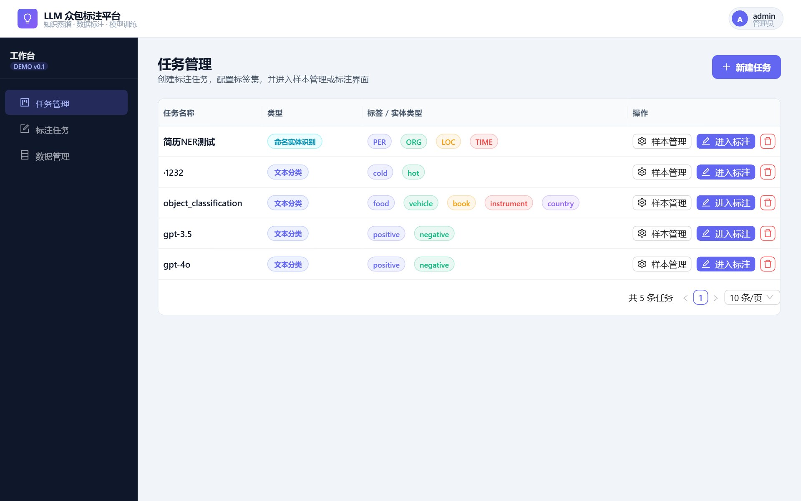
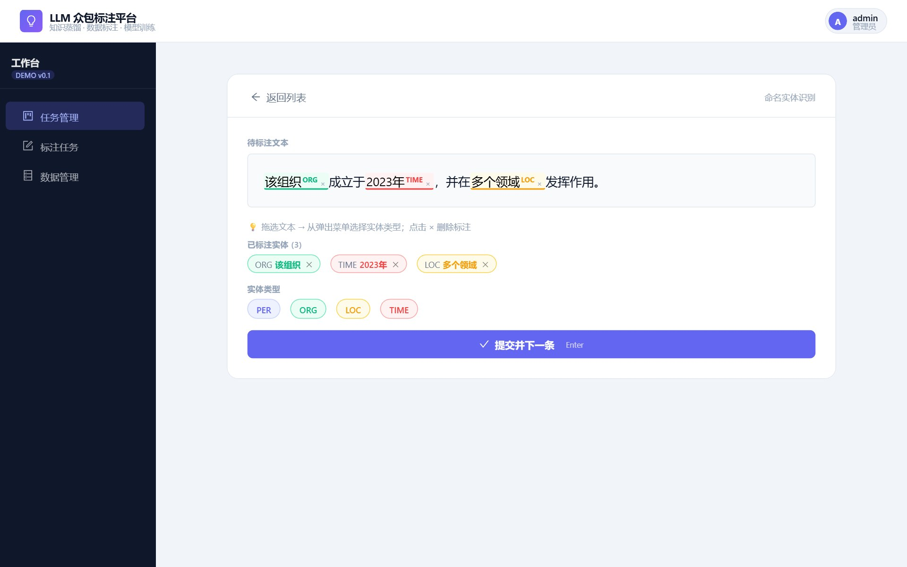
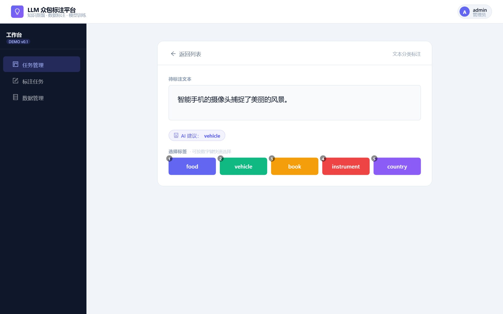
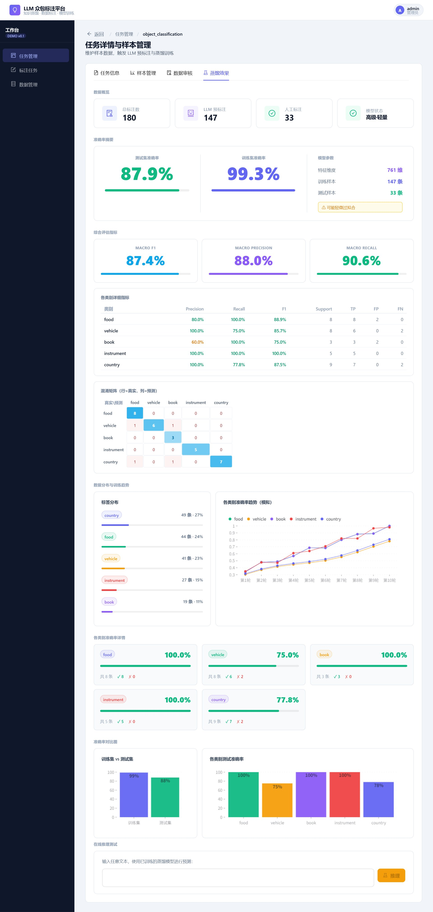

# crowd-annotation-platform

A text-annotation platform for assigning samples, correcting model drafts, reviewing
submissions, and exporting labelled datasets: admin and annotator roles, per-annotator
assignment, multi-round review, local LLM pre-labelling, CSV/JSON export, and a
dashboard that trains a student model on what comes out.

It was built to produce corpora that did not exist yet, which is why model drafts and
human labels are stored as separate sources rather than merged.

React + Ant Design, Node/Express, MongoDB.



## What it does

The whole loop is: **an admin imports samples and assigns them → an annotator labels a
queue, correcting model drafts rather than starting cold → a reviewer passes over the
submissions → the accepted labels export as a dataset**, optionally training a student
model on the way out. Everything below is one of those five steps.

**Tasks and samples.** An admin creates a classification or NER task, imports samples
from a file, and assigns ranges of them to annotators. Each annotator gets a queue and a
`next-sample` endpoint that serves it.

Where the samples have been assigned, the queues are disjoint by construction and two
annotators cannot be handed the same item. Where they have not, everyone draws from one
pool and two annotators can — `next-sample` filters on `assignedTo` and on what you have
already done, and there is no atomic claim. Assignment is what makes the queues exclusive,
not the endpoint.

**Annotation.** Separate interfaces for span-level NER and for classification, both
keyboard-driven — the label set comes from the task config, so a new task inside either
of those two modes needs no new page. A genuinely new interaction would: those are the
two that exist.

| | |
|---|---|
|  |  |

**Review.** Submitted annotations go into a review queue; a reviewer accepts or rejects
individually or in batches (`PATCH /:annId/review`, `POST /batch-review`). Rejected
items return to the annotator's queue rather than being silently dropped.

**LLM pre-labelling.** A task can be pre-labelled by a local Ollama model, or by Claude
if a key is configured, so annotators correct a draft instead of starting from an empty
page. Pre-labels are stored as a distinct source, never mixed into human labels — which
is the whole point: a task can be exported as human-only, model-only, or both.

**Distillation dashboard.** From a finished task you can train a lightweight student
model on the collected labels and see train/test accuracy, macro P/R/F1, per-class
metrics, a confusion matrix and the label distribution in the browser. It closes the loop
from raw text to a trained classifier without leaving the app.

There is no real training curve: the per-class trend chart is a synthetic ramp to the
final accuracies, and the UI labels it 模拟 rather than pretending otherwise. Per-epoch
history would need the trainer to report it, which it does not.

## What it actually holds

**14 tasks, 94,469 samples, 135,835 annotations.** Most of that is bulk import: four
public corpora — TNEWS 15-class (47,345), AGNews (19,998), shopping sentiment (20,000)
and SemEval-2016 stance (4,063) — brought in with their existing gold labels, to see
whether the import, assignment and export paths held up at that size.

The part that went through the review queue a sample at a time is **3,063 samples**,
across ten tasks: five of 500 classification items each, four NER sets of 250, 210, 41
and 41, and one 21-item scratch task — 3,063 exactly, which is also 94,469 minus the
91,406 imported. The largest of them is 500 samples over five classes, drafted by a local
model and then checked here one at a time, which is the workflow this platform exists
for.

**41,623 of the annotations are LLM pre-labels**, carrying a separate flag and never
merged into the human ones. Keeping them apart is what lets a task be exported as
human-only, model-only, or both.



## Running it

Requires Node 18+, MongoDB, and — for pre-labelling — a local [Ollama](https://ollama.com).

```bash
cp .env.example backend/.env    # fill in at minimum JWT_SECRET and MONGO_URI
cd backend  && npm install && npm run dev     # terminal 1, :4000
```

```bash
cd frontend && npm install && npm run dev     # terminal 2, :5173
```

Two terminals, each starting from the repository root — `npm run dev` does not return,
and the second `cd` is relative to the root, not to `backend`.

On Windows, `./start-all.ps1` checks the MongoDB service, checks Ollama, and brings both
halves up in separate windows.

### The first admin

There is no API that creates one. `POST /auth/register` hard-codes `role: 'annotator'`
so a client cannot promote itself, and every admin route sits behind `adminOnly`, so a
fresh database has no way in. That is the right default and it is also a dead end on
first run, so: register through the UI at `:5173`, then promote that row once.

```bash
mongosh crowd_platform --eval 'db.users.updateOne({username:"<you>"},{$set:{role:"admin"}})'
```

Registering first rather than inserting a user directly is deliberate — passwords are
bcrypt hashes at cost 10, and `/auth/register` is what produces a valid one.

Then, as that admin: create a task, import a CSV or JSON file of samples, and assign
ranges of them to annotators.

| Variable | |
|---|---|
| `MONGO_URI` | defaults to `mongodb://localhost:27017/crowd_platform` |
| `JWT_SECRET` | **set this** — falls back to a dev default and warns loudly |
| `PORT` / `CORS_ORIGIN` | API port and allowed origin |
| `OLLAMA_BASE_URL` / `OLLAMA_MODEL` | local pre-labelling backend |
| `ANTHROPIC_API_KEY` / `CLAUDE_MODEL` | optional hosted pre-labelling backend |

## Layout

```
backend/src
  index.js        express app, mongo connection
  models/         User · Task · Sample · Annotation
  routes/         auth · users · tasks · annotations · llm · distill
  middleware/     JWT auth
frontend/src
  pages/          login · task list · task detail · annotation · review · data management
  api/client.js   fetch wrapper, token handling
docs/
  DATABASE_ER_DIAGRAM.md    entity relationships, as Mermaid
```

The four collections and their relationships are in
[docs/DATABASE_ER_DIAGRAM.md](docs/DATABASE_ER_DIAGRAM.md).

## Status

Built as an undergraduate thesis project, and it ran in earnest for exactly one job:
producing the corpora it was built for. It did that job. It is not hardened past it — no
rate limiting, no password policy, and the JWT secret falls back to a development default
if you do not set one. Treat it as a local tool, not a deployment.

**One person did the annotating.** Two annotator accounts exist and hold seventeen
annotations between them; everything else is under the admin account. So there is no
inter-annotator agreement to report, and the platform implements no Cohen's Kappa. A
multi-round review queue with a single reviewer catches that reviewer's own second-pass
disagreements, which is worth something and is not the same thing.

The screenshots above are from a demo instance, not that one — the sidebar says
`DEMO v0.1` and the task list has five tasks, against the fourteen described above. Its
samples are synthetic sentences written for the screenshots. The real corpora are other
people's licensed text and my own generated sets, neither of which belongs in a README.
