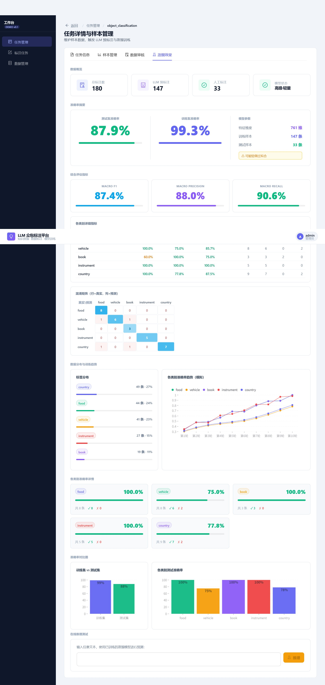

# crowd-annotation-platform

A crowdsourced text-annotation service: admin and annotator roles, per-annotator sample
assignment, multi-round review, local LLM pre-labelling, and CSV/JSON dataset export.

It exists because a knowledge-distillation study needed labelled corpora that did not
exist yet. This is the upstream half of that work — the datasets it produces are the
input to **llm-distill-study**, and the distillation dashboard below is where the two
meet.

The stack is deliberately boring: React + Ant Design, Node/Express, MongoDB. The
interesting part is the annotation workflow, not the CRUD.


## What it does

**Tasks and samples.** An admin creates a classification or NER task, imports samples
from a file, and assigns ranges of them to annotators. Each annotator gets a queue and
a `next-sample` endpoint, so two people never land on the same item by accident.

**Annotation.** Separate interfaces for span-level NER and for classification, both
keyboard-driven — the label set comes from the task config, so adding a task type does
not mean writing a new page.

| | |
|---|---|
|  |  |

**Review.** Submitted annotations go into a review queue; a reviewer accepts or rejects
individually or in batches (`PATCH /:annId/review`, `POST /batch-review`). Rejected
items return to the annotator's queue rather than being silently dropped.

**LLM pre-labelling.** A task can be pre-labelled by a local Ollama model, or by Claude
if a key is configured, so annotators correct a draft instead of starting from an empty
page. Pre-labels are stored as a distinct source, never mixed into human labels — which
is the whole point, since the downstream study compares those sources against each other.

**Distillation dashboard.** From a finished task you can train a lightweight student
model on the collected labels and see accuracy, per-class distribution, a confusion
matrix and training curves in the browser. It closes the loop from raw text to a trained
classifier without leaving the app.

## What it actually holds

**14 tasks, 94,469 samples, 135,835 annotations.** Most of that is bulk import: four
public corpora — TNEWS 15-class (47,345), AGNews (19,998), shopping sentiment (20,000)
and SemEval-2016 stance (4,063) — brought in with their existing gold labels for the
scale-up experiments.

The part that went through the review queue a sample at a time is about **3,000 samples**,
across five 500-item classification tasks and three NER tasks. The main experiment
corpus is one of those: 500 samples over five deliberately non-overlapping classes
(food, vehicle, book, instrument, country), generated by a local Qwen3:14b across roughly
twenty subtopics, then checked individually here.

**41,623 of the annotations are LLM pre-labels**, carrying a separate flag and never
merged into the human ones — which is the point rather than a detail, because the
downstream study's whole question is how those two sources compare.

| | |
|---|---|
|  |  |

## Running it

Requires Node 18+, MongoDB, and — for pre-labelling — a local [Ollama](https://ollama.com).

```bash
cp .env.example backend/.env    # fill in at minimum JWT_SECRET and MONGO_URI
cd backend  && npm install && npm run dev     # :4000
cd frontend && npm install && npm run dev     # :5173
```

On Windows, `./start-all.ps1` checks the MongoDB service, checks Ollama, and brings both
halves up in separate windows.

| Variable | |
|---|---|
| `MONGO_URI` | defaults to `mongodb://localhost:27017/crowd_platform` |
| `JWT_SECRET` | **set this** — falls back to a dev default and warns loudly |
| `PORT` / `CORS_ORIGIN` | API port and allowed origin |
| `OLLAMA_BASE_URL` / `OLLAMA_MODEL` | local pre-labelling backend |
| `ANTHROPIC_API_KEY` / `CLAUDE_MODEL` | optional hosted pre-labelling backend |

## Layout

```
backend/src
  index.js        express app, mongo connection
  models/         User · Task · Sample · Annotation
  routes/         auth · users · tasks · annotations · llm · distill
  middleware/     JWT auth
frontend/src
  pages/          login · task list · task detail · annotation · review · data management
  api/client.js   fetch wrapper, token handling
docs/
  DATABASE_ER_DIAGRAM.md    entity relationships, as Mermaid
```

The four collections and their relationships are in
[docs/DATABASE_ER_DIAGRAM.md](docs/DATABASE_ER_DIAGRAM.md).

## Status

Built as an undergraduate thesis project, and it ran in earnest for exactly one job:
producing the corpora behind
[llm-distill-study](https://github.com/liu-x27/llm-distill-study). It did that job. It is
not hardened past it — no rate limiting, no password policy, and the JWT secret falls
back to a development default if you do not set one.

**One person did the annotating.** Two annotator accounts exist and hold seventeen
annotations between them; everything else is under the admin account. So there is no
inter-annotator agreement to report, and the platform implements no Cohen's Kappa — a
gap the thesis names in its own limitations rather than one this README is working
around. A multi-round review queue with a single reviewer catches a reviewer's own
second-pass disagreements, which is worth something and is not the same thing.

The screenshots above are from that working deployment.
