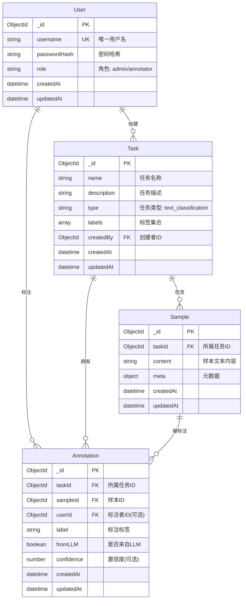

# 数据库ER图

## 实体关系图

### Mermaid格式（推荐，支持Markdown渲染）



### 文本版ER图（备用）

```
┌─────────────────────────────────┐
│            User                 │
├─────────────────────────────────┤
│ _id (PK)                        │
│ username (UK)                   │
│ passwordHash                    │
│ role (admin/annotator)          │
│ createdAt                       │
│ updatedAt                       │
└─────────────────────────────────┘
         │                    │
         │ 1                  │ 1
         │                    │
         │                    │
         ▼                    ▼
┌─────────────────────────────────┐
│            Task                 │
├─────────────────────────────────┤
│ _id (PK)                        │
│ name                            │
│ description                     │
│ type                            │
│ labels []                       │
│ createdBy (FK → User._id)       │
│ createdAt                       │
│ updatedAt                       │
└─────────────────────────────────┘
         │                    │
         │ 1                  │ 1
         │                    │
         │                    │
         ▼                    ▼
┌─────────────────────────────────┐      ┌─────────────────────────────────┐
│          Sample                 │      │        Annotation                │
├─────────────────────────────────┤      ├─────────────────────────────────┤
│ _id (PK)                        │      │ _id (PK)                        │
│ taskId (FK → Task._id)          │◄─────│ taskId (FK → Task._id)          │
│ content                         │  1   │ sampleId (FK → Sample._id)      │
│ meta                            │  │   │ userId (FK → User._id, 可选)    │
│ createdAt                       │  │   │ label                           │
│ updatedAt                       │  │   │ fromLLM (boolean)               │
└─────────────────────────────────┘  │   │ confidence (可选)               │
                                     │   │ createdAt                       │
                                     │   │ updatedAt                       │
                                     │   └─────────────────────────────────┘
                                     │
                                     │ N
                                     │
                                     │
                                     └─────────────────────────────────┐
                                                                       │
                                                               ┌───────┴───────┐
                                                               │     User      │
                                                               │  (标注者)     │
                                                               └───────────────┘

关系说明：
- User 1:N Task (一个用户创建多个任务)
- User 1:N Annotation (一个用户进行多个标注，可选)
- Task 1:N Sample (一个任务包含多个样本)
- Task 1:N Annotation (一个任务拥有多个标注)
- Sample 1:N Annotation (一个样本可以有多个标注)
```

## 实体关系说明

### 1. User (用户表)
- **主键**: `_id`
- **唯一约束**: `username`
- **关系**:
  - 一对多：一个用户可创建多个任务 (`Task.createdBy`)
  - 一对多：一个用户可进行多个标注 (`Annotation.userId`，可选)

### 2. Task (任务表)
- **主键**: `_id`
- **外键**: `createdBy` → `User._id`
- **关系**:
  - 多对一：多个任务属于一个用户 (`createdBy`)
  - 一对多：一个任务包含多个样本 (`Sample.taskId`)
  - 一对多：一个任务拥有多个标注 (`Annotation.taskId`)

### 3. Sample (样本表)
- **主键**: `_id`
- **外键**: `taskId` → `Task._id`
- **关系**:
  - 多对一：多个样本属于一个任务 (`taskId`)
  - 一对多：一个样本可以有多个标注 (`Annotation.sampleId`)

### 4. Annotation (标注表)
- **主键**: `_id`
- **外键**: 
  - `taskId` → `Task._id`
  - `sampleId` → `Sample._id`
  - `userId` → `User._id` (可选，LLM标注可能为空)
- **关系**:
  - 多对一：多个标注属于一个任务 (`taskId`)
  - 多对一：多个标注属于一个样本 (`sampleId`)
  - 多对一：多个标注属于一个用户 (`userId`，可选)

## 关系基数说明

| 关系 | 基数 | 说明 |
|------|------|------|
| User → Task | 1:N | 一个用户可创建多个任务 |
| User → Annotation | 1:N | 一个用户可进行多个标注（LLM标注可能没有userId） |
| Task → Sample | 1:N | 一个任务包含多个样本 |
| Task → Annotation | 1:N | 一个任务拥有多个标注 |
| Sample → Annotation | 1:N | 一个样本可以有多个标注（LLM预标注 + 人工标注） |

## 特殊说明

1. **Annotation.userId 可选**：
   - 人工标注：`userId` 有值，`fromLLM = false`
   - LLM预标注：`userId` 可能为空，`fromLLM = true`

2. **一个样本可以有多个标注**：
   - LLM预标注（`fromLLM = true`）
   - 人工标注（`fromLLM = false`，`userId` 有值）
   - 同一用户可能对同一样本进行多次标注（历史记录）

3. **时间戳字段**：
   - 所有表都有 `createdAt` 和 `updatedAt` 字段（Mongoose自动管理）

## 索引建议

为了提高查询性能，建议创建以下索引：

```javascript
// User
User.createIndex({ username: 1 }, { unique: true });

// Task
Task.createIndex({ createdBy: 1 });
Task.createIndex({ createdAt: -1 });

// Sample
Sample.createIndex({ taskId: 1 });
Sample.createIndex({ taskId: 1, createdAt: -1 });

// Annotation
Annotation.createIndex({ taskId: 1 });
Annotation.createIndex({ sampleId: 1 });
Annotation.createIndex({ userId: 1 });
Annotation.createIndex({ taskId: 1, fromLLM: 1 });
Annotation.createIndex({ sampleId: 1, fromLLM: 1 });
```

## 数据流示例

### 标注工作流
1. **管理员创建任务**：`User` (admin) → `Task`
2. **添加样本**：`Task` → `Sample`
3. **LLM预标注**：`Sample` → `Annotation` (fromLLM=true, userId=null)
4. **人工标注**：`User` (annotator) + `Sample` → `Annotation` (fromLLM=false, userId=annotator._id)

### 查询场景
- **获取任务的所有样本**：`Task._id` → `Sample.taskId`
- **获取样本的所有标注**：`Sample._id` → `Annotation.sampleId`
- **获取用户的标注记录**：`User._id` → `Annotation.userId`
- **获取任务的标注统计**：`Task._id` → `Annotation.taskId`

---

*最后更新：2025年12月25日*

